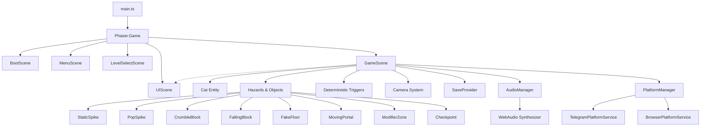

# Архитектура — CatTrap

## 1. Обзор архитектуры

CatTrap построен на модульной компонентной архитектуре с разделением ответственности на независимые слои:

---

## 2. Сцены Phaser 3

1. **`BootScene`**:
   - Стартовая сцена прелоадера.
   - Вызывает `PixelArtGenerator` для генерации всех процедурных пиксель-арт текстур котика, тайлов, ловушек, частиц и портала.
   - Инициализирует `PlatformManager` (вызывает `Telegram.WebApp.ready()`, `expand()`).
   - Инициализирует `AudioManager` и звуковой синтезатор.
   - Переключается на `MenuScene`.

2. **`MenuScene`**:
   - Главное меню.
   - Отображает логотип CatTrap, анимированного котика, портал.
   - Кнопки: «Играть / Продолжить (Уровень X)», «Выбор уровня», «Настройки», «Как играть».
   - Адаптируется под portrait и landscape.

3. **`LevelSelectScene`**:
   - Сетка уровней 1–10.
   - Индикация пройденных уровней (`✓`), текущего открытого уровня, заблокированных уровней (замочек), времени и смертей.
   - Кнопка возврата в меню.

4. **`GameScene`**:
   - Основной геймплей.
   - Загружает данные уровня (`LevelData`).
   - Физика: Arcade Physics с фиксированным шагом (`fixedStep: true`, 60 Гц).
   - Мгновенный цикл рестарта при смерти:
     - 0–80 мс: Hit-stop (заморозка)
     - 80–250 мс: Анимация смерти котика + звук + вибрация (Haptics)
     - <400 мс: Мгновенный сброс уровня или возврат к активному чекпоинту.
   - Взаимодействие с `UIScene` через события Phaser (`Events.UI_UPDATE`).

5. **`UIScene`**:
   - Оверлей пользовательского интерфейса, работающий параллельно с `GameScene`.
   - Верхний HUD: кнопка паузы, номер уровня, таймер попытки.
   - Сенсорные экранные кнопки управления (влево, вправо, прыжок).
   - Меню паузы (50% затемнение экрана, «Продолжить», «Начать заново», «Выбор уровня», «Настройки», «Главное меню»).
   - Экран настроек (звук, музыка, вибрация, тряска экрана, прозрачность кнопок).
   - Экран «Глава пройдена!» после 10 уровня.
   - Окно поворота экрана («Продолжить»).

---

## 3. Детерминированная система триггеров (`TriggerManager`)

Каждый уровень описывается декларативными данными (`LevelData`):
- `spawn`: `{ x, y }`
- `tilemap`: массив тайлов (пол, платформы, декорации)
- `hazards`: список объектов и ловушек
- `triggers`: массив детерминированных условий активации

Условия (`condition`):
- `player_x > X`
- `player_y > Y`
- `player_overlap_zone`
- `tile_touch`

Действия (`action`):
- `pop_spike` — поднять выдвижной шип
- `drop_block` — запустить падение потолочного блока
- `collapse_floor` — начать разрушение обманного пола
- `move_portal` — переместить портал на следующую точку
- `chain_pop_spikes` — последовательный запуск шипов с интервалом 120 мс

Каждый триггер поддерживает:
- `delay`: задержка перед исполнением в мс
- `once`: однократное или повторяющееся действие
- `resetOnDeath`: сброс в исходное состояние при рестарте

---

## 4. Платформенный слой (`PlatformService`)

Платформенный слой изолирует все специфичные вызовы окружения:
- `BrowserPlatformService` — базовый веб, обработка клавиатуры, стандартный `localStorage`.
- `TelegramPlatformService` — интеграция с Telegram WebApp:
  - `Telegram.WebApp.ready()` и `expand()`
  - Отключение вертикальных свайпов для предотвращения случайного закрытия шторки
  - Обработка `safeAreaInset` и `contentSafeAreaInset`
  - Интеграция с нативной `BackButton` (в игре -> пауза, в паузе -> возврат)
  - `HapticFeedback.impactOccurred` / `notificationOccurred` (смерть, победа).

---

## 5. Аудиосистема (`SoundSynthesizer`)

Все звуки синтезируются в реальном времени через `AudioContext` (WebAudio API):
- Не требует загрузки внешних `.wav` / `.mp3` файлов.
- Нулевые сетевые задержки и мгновенная доступность в Telegram Mini App.
- Процедурный синтез ретро-звуков (прыжок, приземление, хруст шипа, разрушение блока, смена гравитации, вход в портал, клик UI).
- Ненавязчивый спокойный chiptune-loop с возможностью отключения в настройках.
- Автоматическая пауза при потере фокуса (`visibilitychange`, `blur`).
